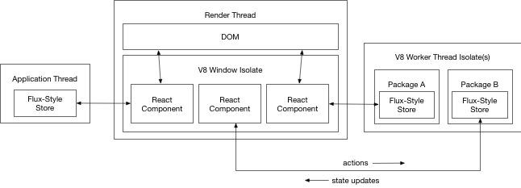
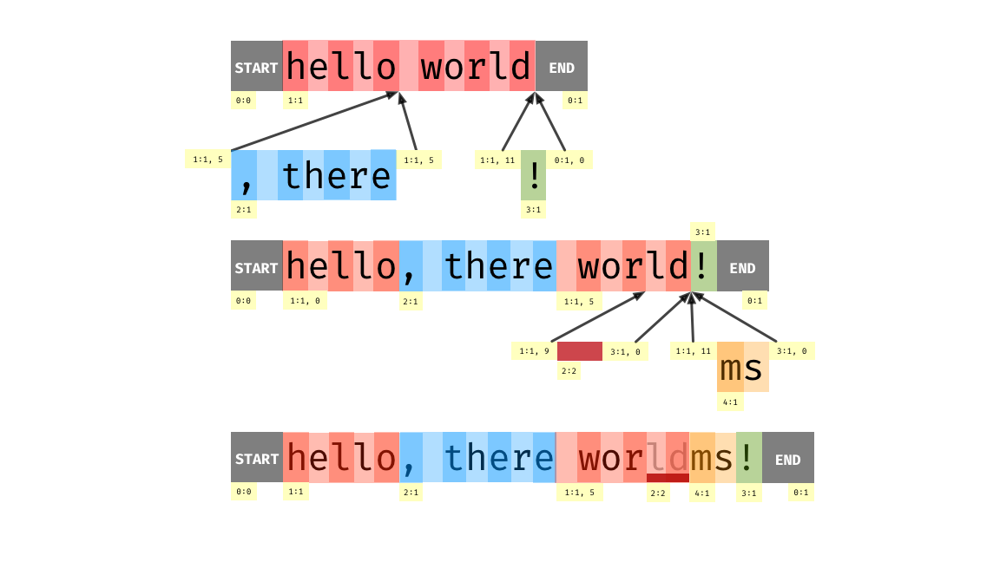

# About Xray

Xray is an experimental Electron-based text editor informed by what we've learned in the four years since the launch of Atom. In the short term, this project is a testbed for rapidly iterating on several radical ideas without risking the stability of Atom. The longer term future of the code in this repository will become clearer after a few months of progress. We're excited, but we don't want to get ahead of ourselves here.

# About this guide

This guide is *also* an experiment in a new product development process for our team, *documentation-driven development*. Test-driven development can help organize a pairing session by helping us agree on the "what" before we start worrying too much about the "how." We hope documentation-driven development can serve a similar role for collaboration on Xray.

Before we embark on a major feature or architectural component, our goal is to explain our thinking in this guide. This will slow us down a bit, but in exchange we'll be forced to think clearly about important decisions, leave a historical record for the reasons behind those decisions for future developers (including ourselves), and offer a handy way for contributors to both understand the system's past and influence its future.

Early on, this document will server more as an informal specification for the product, and will describe things that don't exist yet. We'll provide notes on implementation status where relevant.

# Foundational priorities

Our goal is to build an approachable, attractive, cross-platform text editor that is designed from the beginning around the following foundational priorities:

## High performance

*Xray feels lightweight and responsive.*

We design our features to be responsive from the beginning. We reliably provide visual feedback within the latency windows suggested by the [RAIL performance model](https://developers.google.com/web/fundamentals/performance/rail). For all interactions, we shoot for the following targets on the hardware of our median user:

| Duration | Action |    
| - | - |
| 8ms | Scrolling, animations, and fine-grained interactions such as typing or cursor movement. |
| 50ms | Coarse-grained interactions such as opening a file or initiating a search. If we can't complete the action within this window, we should show a progress bar. |
| 150ms | Opening an application window. |

We are careful to maximize throughput of batch operations such as project-wide search. Memory consumption is kept within a low constant factor of the size of the project and open buffer set, but we trade memory for speed and extensibility so long as memory requirements are reasonable.

## Collaboration

*Xray makes it as easy to code together as it is to code alone.*

We design features for collaborative use from the beginning. Editors and other relevant UI elements are designed to be occupied by multiple users. Interactions with the file system and other resources such as subprocesses are abstracted to work over network connections.

## Extensibility

*Xray gives developers control over their own tools.*

We expose convenient and powerful APIs to enable users to add non-trivial functionality to the application. We balance the power of our APIs with the ability to ensure the responsiveness, stability, and security of the application as a whole. We avoid leaking implementation details and use versioning where possible to enable a sustained rapid development without destabilizing the package ecosystem.

## Web compatibility

*Editing on GitHub feels like editing in Xray.*

We provide a feature-rich editor component that can be used on the web and within other Electron applications. This will ultimately help us provide a more unified experience between GitHub.com and this editor and give us a stronger base of stakeholders in the core editing technology. If this forces serious performance compromises we may potentially drop this objective, but we don't think that it will.

# Architecture

Martin Fowler defines software architecture those decisions which are both important and hard to change. Since these decisions are hard to change, we need to be sure that our foundational priorities are well-served by these decisions.

## Our UI is built with Electron

Electron adds a lot of overhead, which detracts from our top priority of high-performance. However, Electron is also the best approach that we know of to deliver a cross-platform, extensible user interface. Atom proved that developers want to add non-trivial UI elements to their editor, and we still see web technologies as the most viable way to offer them that ability. We also want to provide extension authors with a scripting API, and the JavaScript VM that ships with Electron is well suited to that task.

The fundamental question is whether we can gain Electron's benefits for extensibility while still meeting our desired performance goals. Our hypothesis is that it's possible–with the right architecture.

## The render thread is isolated

Our first line of defense in preventing the render thread from blocking is to be extremely careful about the code we choose to run on that thread. In Xray, the render thread has one job, to render the user interface and handle user interactions by routing them to other threads as quickly as possible.



The user interface is implemented in React, with a small number of "container" components that own subtrees of property-driven stateless components. Each component has a connection to a store. The component has synchronous access to the most recent copy of the store's state and the ability to dispatch actions to the store over an asynchronous channel.

The similarity to the Flux architecture gives us confidence that isolating components in this way will be viable. In specific cases involving components that read the DOM, the asynchronous nature of the store connection could present problems. For example, when the editor first renders, we need to measure the editor's dimensions and some metrics about line height and block decorations in order to inform the underlying store about how much content to render. If Electron renders a frame before the model updates its dimensions, this could lead to a flicker where no content is rendered when the editor is initially opened.

In these cases, components can block the main thread waiting on the next store update for up to some maximum duration. This can allow us to delay the next frame render until we have a chance to update the DOM to the desired state. We can require packages to request this feature on installation and easily detect when packages are overusing it.

## Packages run primarily in web workers

A misbehaving package should not be able to impact the responsiveness of the application. The best way to guarantee this while preserving ease of development is to activate packages on worker threads. We can do a worker thread per package or run packages in their own contexts across a pool of threads.

Packages *can* run code on the render thread by specifying versioned components in their `package.json`.

```json
"components": {
  "TodoList": "./components/todo-list.js"
}
```

If a package called `my-todos` had the above entry in its `package.json`, it could request that the workspace attach that component by referring to `myTodos.TodoList` when adding an item. On package installation, we can automatically update the V8 snapshot to include the components of every installed package. Components will only be dynamically loaded from the provided paths in development mode.

APIs for interacting with the application and the underlying operating system will only be available within worker threads, discouraging package authors from putting too much logic into their views.

## Application logic is written in Rust

The core of the application is implemented in a pure Rust crate (`/xray_core`) and made accessible to JavaScript through N-API bindings (`/xray_node`). This module is loaded into the Electron application (`/xray_electron`) via Node's native add-on system. The binding layer will be responsible for exposing a thread-safe API to JS so that the same native module can be used in the render thread and worker threads.

All of the core application code other than the rendering logic should be written in Rust. This will ensure that it has a minimal footprint to load and execute, and Rust's robust type system will help us maintain it more efficiently than dynamically typed code. A language that is fundamentally designed for multi-threading will also make it easier to exploit parallelism whenever the need arises, whereas JavaScript's single-threaded nature makes parallelism awkward and challenging.

Fundamentally, we want to spend our time writing in a language that is fast by default. It's true that it's possible to write slow Rust also possible to write fast JavaScript. It's *also* true that it's much harder to write slow Rust than it is to write slow JavaScript. By spending fewer resources on the implementation of the platform itself, we'll make more resources available to run package code.

## Text is stored in a copy-on-write CRDT

To fully exploit Rust's unique advantage of parallelism, we need to store text in a concurrency-friendly way. We use a variant of RGA called RGASplit, which is described in [this research paper](https://pages.lip6.fr/Marc.Shapiro/papers/rgasplit-group2016-11.pdf).



In RGA split, the document is stored as a sequence of insertion fragments. In the example above, the document starts as just a single insertion containing `hello world`. We then introduce `, there` and `!` as additional insertions, splitting the original insertion into two fragments. To delete the `ld` at the end of `world` in the third step, we create another fragment containing just the `ld` and mark it as deleted with a tombstone.

Structuring the document in this way has a number of advantages.

* Real-time collaboration works out of the box
* Concurrent edits: Any thread can read or write its own replica of the document without diverging in the presence of concurrent edits.
* Integrated non-linear history: To undo any group of operations, we increment an undo counter associated with any insertions and deletions that controls their visibility. This means we only need to store operation ids in the history rather than operations themselves, and we can undo any operation at any time rather than adhering to historical order.
* Stable logical positions: Instead of tracking the location of markers on every edit, we can refer to stable positions that are guaranteed to be valid for any future buffer state. For example, we can mark the positions of all search results in a background thread and continue to interpret them in a foreground thread if edits are performed in the meantime.

## System interaction is centralized in a "host process"

File system interactions are routed through a central server called the *host process*.

The server serializes buffer loads and saves on a per file basis, and maintains a persistent database of CRDT operations for each file. As edits are performed in windows, they are streamed to the host process to be stored and echoed out to any other windows with the same open buffer. This enables unsaved changes to always be incrementally preserved in case of a crash or power failure and preserves the history associated with a file indefinitely.

Early on, we should design the application process to be capable of connecting to multiple host processes to facilitate real-time collaboration or editing files on a remote server by running a headless host process. To support these use cases, we should prefer implementing most code paths that touch the file system or spawn subprocesses in the host process and interacting with them via RPC.

## Compute derived state asynchronously

We should avoid implementing synchronous APIs that depend on open-ended computations of derived state.


# Development process

## Experiment

At this phase, this code is focused on learning. Whatever code we write should be production-quality, but we don't need to support everything at this phase. We can defer features that don't contribute substantially to learning.

## Documentation-driven development

Before coding, we ask ourselves whether the code we're writing can be motivated by something that's written in the guide. The right approach here will always be a judgment call, but lets err on the side of transparency and see what happens. See [About this guide]() for more details.

## Disciplined monorepo

All code related to Xray should live in this repository, but intra-repository dependencies should be expressed in a disciplined way to ensure that a one-line docs change doesn't require us to rebuild the world. Builds should be finger-printed on a per-component basis and we should aim to keep components granular.

## Community SLA

Well-formulated PRs and issues will receive some form of response by the end of the next business day. If this interferes with our ability to learn, we revisit.

# Open questions

There's a lot we know from experience with Atom, but this is a radically different architecture, and so there are a lot of unknowns as well.
